<h1><p align="center" style='font-size:55px'>Computer-Forensics</p></h1>

<p align='center'>
<a href="https://github.com/Rajbarot16/"></a>
<a href="#"></a>
<a href="#"></a>
</p>
<br>
<a href="#">
<br>
<h2>Cfred's Hacking Case Walkthrough </h2>
<p style='font-size:20px'>Case-1: Dell Hacking Case </p>

*  Here we are using CFRED website for analysing Hacking Case which is as below.

* Link:&nbsp;<a href="https://cfreds-archive.nist.gov/Hacking_Case.html">https://cfreds-archive.nist.gov/Hacking_Case.html</a>

<h3>Scenario</h3>

> On 09/20/04 , a Dell CPi notebook computer, serial # VLQLW, was found abandoned along with a wireless PCMCIA card and an external homemade 802.11b antennae. It is suspected that this computer was used for hacking purposes, although cannot be tied to a hacking suspect, G=r=e=g S=c=h=a=r=d=t. (The equal signs are just to prevent web crawlers from indexing this name; there are no equal signs in the image files.)  Schardt also goes by the online nickname of “Mr. Evil” and some of his associates have said that he would park his vehicle within range of Wireless Access Points (like Starbucks and other T-Mobile Hotspots) where he would then intercept internet traffic, attempting to get credit card numbers, usernames & passwords.

> Find any hacking software, evidence of their use, and any data that might have been generated. Attempt to tie the computer to the suspect, G=r=e=g S=c=h=a=r=d=t.v

<br>

**1. What is the image hash? Does the acquisition and verification hash match?**
```
Ans.aee4fcd9301c03b3b054623ca261959a, no acquistion hash found
```
<br>
<p align='center'>
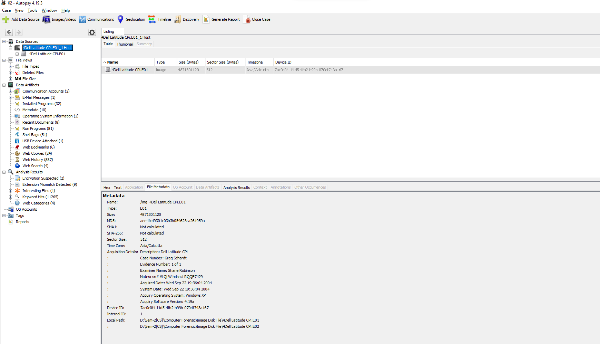
</p>
<br>

**2. What operating system was used on the computer?**
```
Ans. Microsoft Windows XP Professional
```
<br>
<p align='center'>
<a href="#">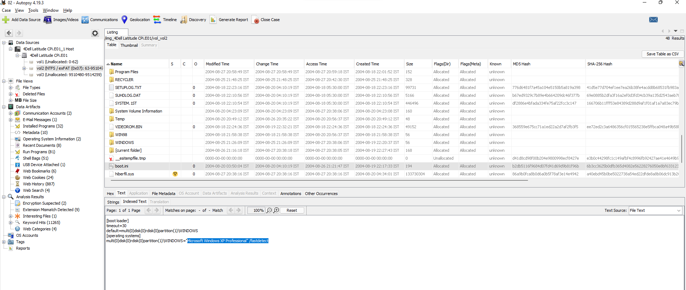</a>
</p>
<br>

**3. When was the install date?**
```
Ans. step-1: Go to the path:“C:\Windows\system32\config\Software\Microsoft\Windows NT\CurrentVersion\InstallDate."
     step-2: Thursday, August 19, 2004 10:48:27 PM UTC
```
<br>
<p align='center'>
<a href="#">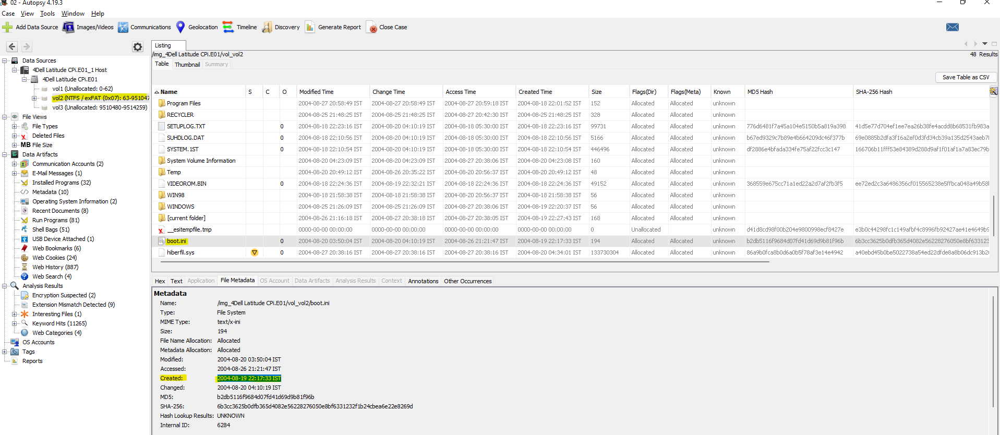</a>
</p>
<br>

**4. What is the timezone settings?**
```
Ans. Step-1: Go to the path:“C:\windows\system32\config\system\CurrentControlSet001\Control\TimeZoneInformation”.
     Step-2: Central Standard time.
```
<br>
<p align='center'>
<a href="#">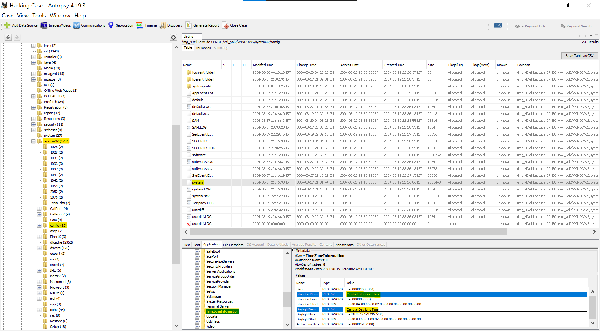</a>
</p>

**5. Who is the registered owner?**
```
Ans. Step-1: Go to the path:“C:\windows\system32\config\software\Microsoft\Windows NT\CurrentVersion\RegisteredOwner”.
     Step-2: Greg Schardt
```
<br>
<p align='center'>
<a href="#">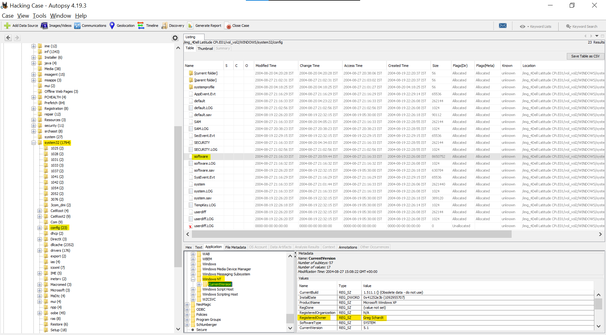</a>
</p>
<br>

**6. What is the computer account name?**
```
Ans. Step-1: Go to the path:“C:\windows\system32\config\SAM\Domains\Users\Names”
     Step-2: Mr.Evil
```
<br>
<p align='center'>
<a href="#">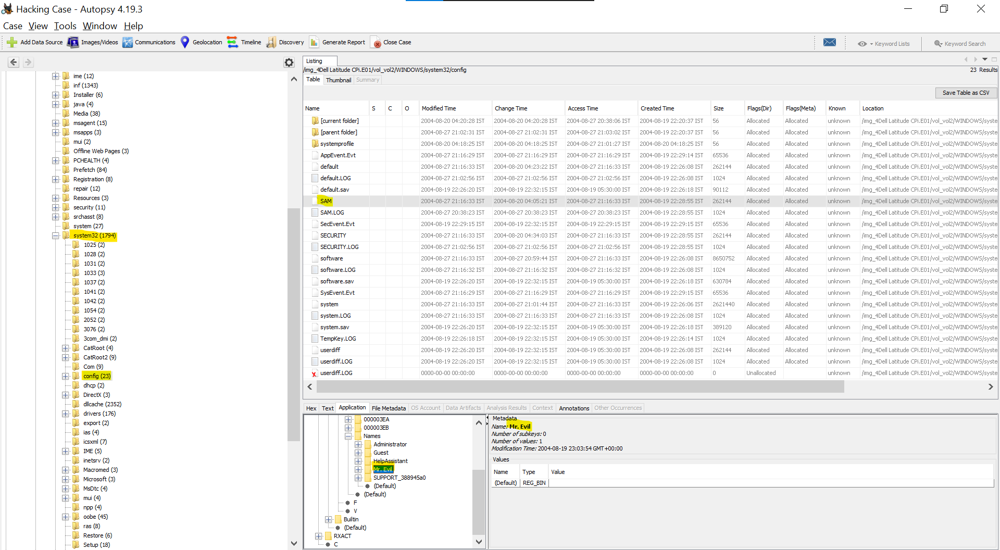</a>
</p>
<br>

**7. What is the primary domain name?**
```
Ans. Step-1: Go to the path:“C:\windows\system32\config\software\Microsoft\Windows NT\CurrentVersion\Winlogon”
     Step-2: N-1A9ODN6ZXK4LQ
```
<br>
<p align='center'>
<a href="#">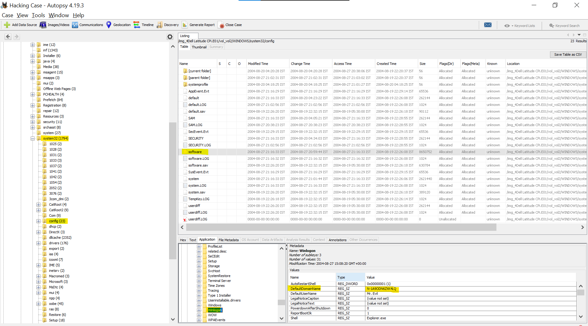</a>
</p>
<br>

**8. When was the last recorded computer shutdown date/time?**
```
Ans. Step-1: Go to the path:“C:\windows\system32\config\system\CurrentControlSet001\Control\Windows\ShutdownTime”
     Step-2: C4 FC 00 07 4D 8C C4 01 
```
<br>
<p align='center'>
<a href="#">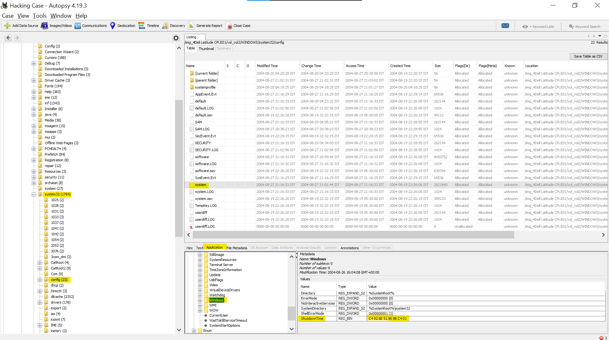</a>
</p>

<br>

**9. How many accounts are recorded (total number)?**
<br>
```
Ans. Step-1: Go to the path:“C:\windows\system32\config\SAM\Domains\Users\Names."
```
<br>```Step-2: There are total 5 Accounts recorded Below  ```
<ul>
  <li style=“list-style-type:square”>Administrator</li>
  <li style=“list-style-type:square”>HelpAssitant</li>
  <li style=“list-style-type:square”>Mr. Evil</li>
  <li style=“list-style-type:square”>Guest</li>
  <li style=“list-style-type:square”>HelpAssitant</li>
  <li style=“list-style-type:square”>Support_388945a0</li>
</ul>

<br>
<p align='center'>
<a href="#">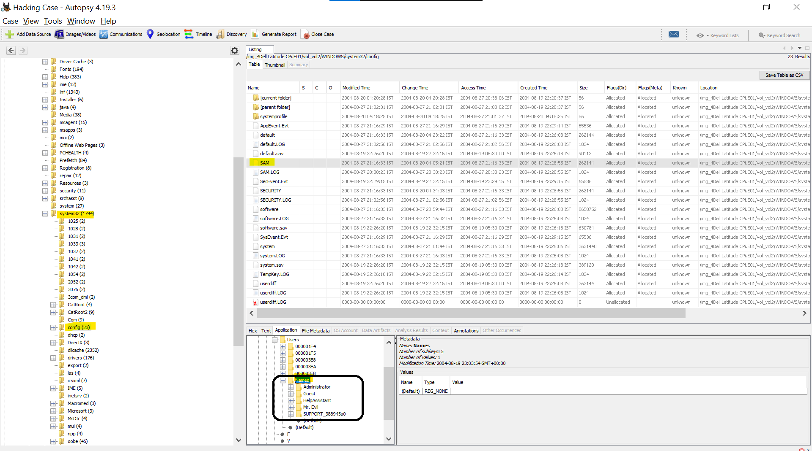</a>
</p>

<br>

**10. What is the account name of the user who mostly uses the computer?**
```
Ans. Mr. Evil logged into the system 15 times.
```
<br>
<p align='center'>
<a href="#">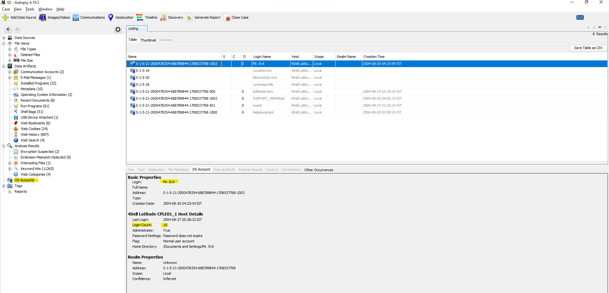</a>
</p>

<br>

**11. Who was the last user to logon to the computer?**
```
Ans. Mr. Evil
```
<br>
<p align='center'>
<a href="#">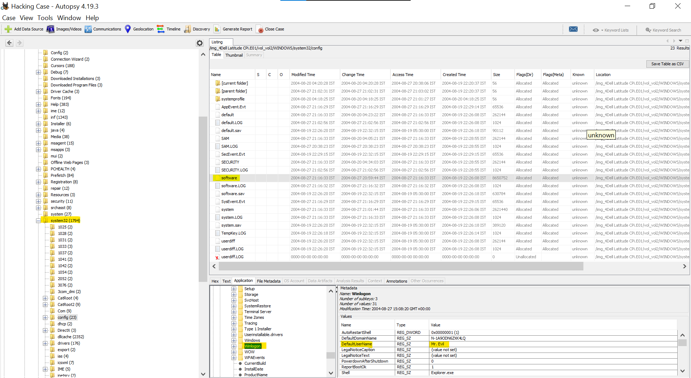</a>
</p>

<br>

**12. A search for the name of “G=r=e=g S=c=h=a=r=d=t” reveals multiple hits. One of these proves that G=r=e=g S=c=h=a=r=d=t is Mr. Evil and is also the administrator of this computer. What file is it? What software program does this file relate to?**
```
Ans. The name of the file is “irunin.ini” & the name of the software program is “Look@LAN”
```
```
The program name Look@LAN is an application that allows users to monitor the clients who are connected to network.
```
```
So in the irunin.ini file, it is mentioned that regowner is Greg Schardt while the LAN user is Mr. Evil which proves that user Mr. Evil & Greg Schardt both are same.
```
<br>
<p align='center'>
<a href="#">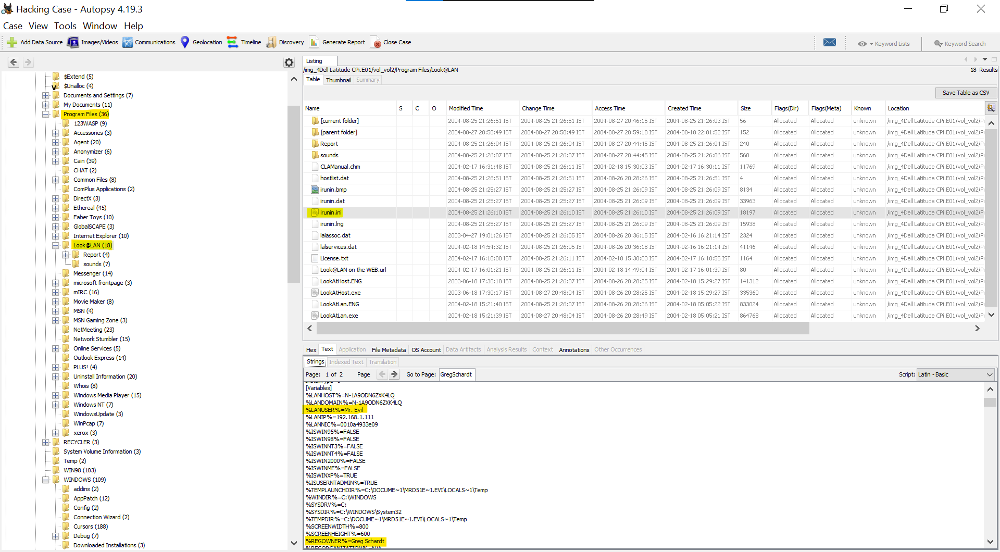</a>
<a href="#">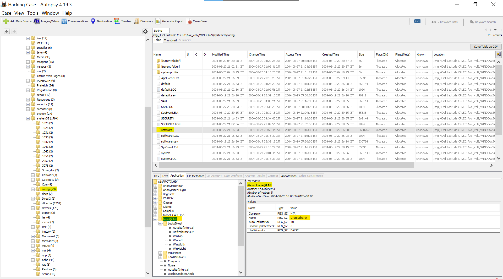</a>
</p>

<br>

**13.  List the network cards used by this computer**
```
Ans.There are two network cards: 
    1)Compaq WL110 Wireless LAN PC Card  
    2)Xircom CardBus Ethernet 100 + Modem 56
```
```
Go to the path:"C:\windows\system32\config\software\Microsoft\Windows NT\CurrentVersion\NetworkCards" 
```
<br>
<p align='center'>
<a href="#">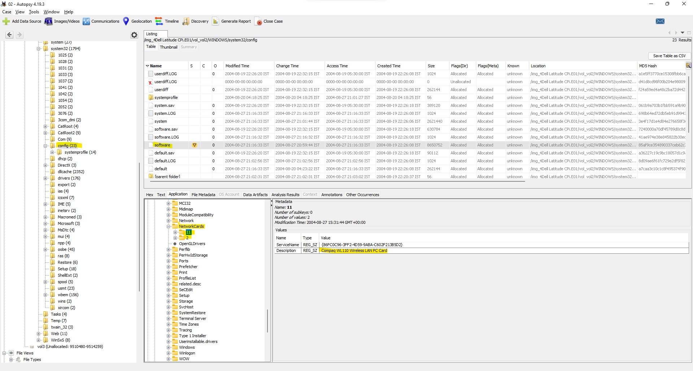</a>
<a href="#">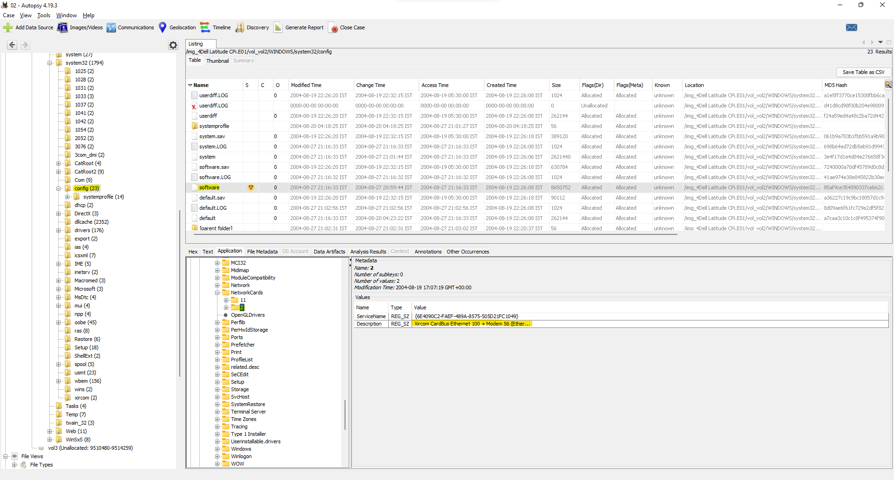</a>
</p>

<br>

**14. This same file reports the IP address and MAC address of the computer. What are they?**
```
Ans. IP Address  : 192.168.1.111
     MAC Address : 00:10:a4:93:3e:09
```
```
Go to the path:"C:\Program Files\Look@LAN\irunin.ini".
```
<br>
<p align='center'>
<a href="#">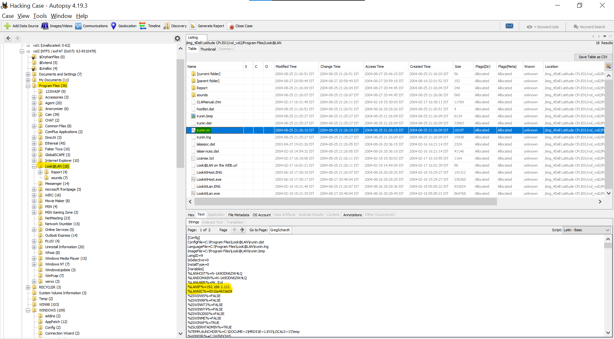</a>
</p>

<br>

**15. An internet search for vendor name/model of NIC cards by MAC address can be used to find out which network interface was used. In the above answer, the first 3 hex characters of the MAC address report the vendor of the card. Which NIC card was used during the installation and set-up for LOOK@LAN?**
```
Ans. On looking for the MAC lookup we found out that company name was: XIRCOM
     So, the NIC card used for setup the Look@LAN is: Xircom CardBus Ethernet 100 + Modem 56 (Ethernet Interface)
```
<br>
<p align='center'>
<a href="#">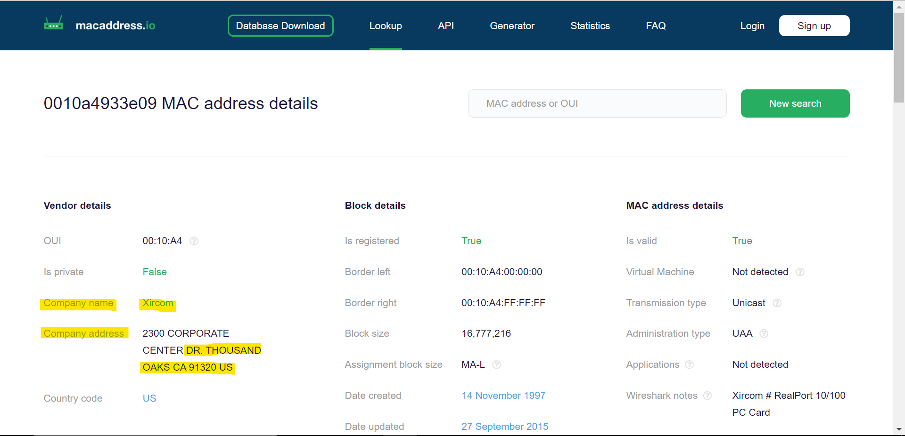</a>
</p>
<br>

**16. Find 6 installed programs that may be used for hacking.**
<br>
```
Ans. Here Six installed Programs that used for Hacking is below table.

```
<table border="5" align="center">
  <tr>
    <th>Program Found</th>
    <th>Description</th>
  </tr>
  <tr>
    <td>(1) 123WASP</td>
    <td>It used to get all stored passwords.</td>
  </tr>
   <tr>
    <td>(2) Look@LAN </td>
    <td>Network Monitoring tool.</td>
  </tr>
   <tr>
    <td>(3) Ethereal</td>
    <td>Packet sniffing tool.</td>
  </tr>
   <tr>
    <td>(4) NetStumbler</td>
    <td>Wireless Networking tool.</td>
  </tr>
   <tr>
    <td>(5) Cain & Abel</td>
    <td>Password Cracking tool.</td>
  </tr>
   <tr>
    <td>(6) Anonymizer</td>
    <td>It is tool which is used to create a proxy.</td>
  </tr>
</table>

<p align='center'>
<a href="#">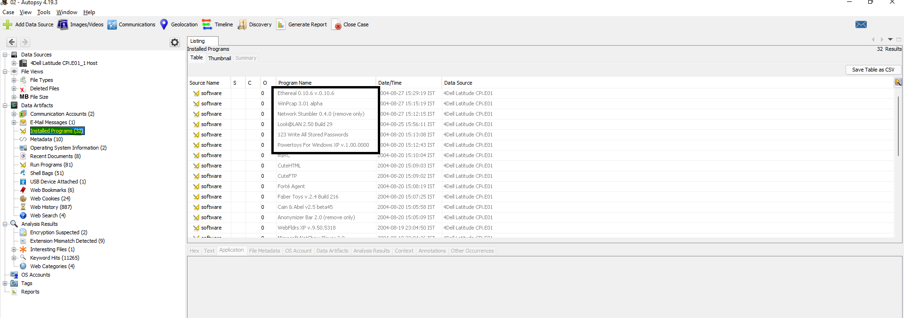</a>
</p>

**17. What is the SMTP email address for Mr. Evil?**
```
Ans. E-mail Address of Mr. Evil is : whoknowsme@sbcglobal.net
     To find this do the keyword search of SMTP.
     Then search for the file NTUSER.DAT, click on it and in the lower pane click on Text Tab. You will find it there.
```
<br>
<p align='center'>

</p>

<br>

**18. What are the NNTP (news server) settings for Mr. Evil?**
```
Ans.NNTP(news server) is: news.dallas.sbcglobal.net 
    NNTP User Name: whoknowsme@sbcglobal.net
    NNTP Password:news.dallas.sbcglobal.netF6E2BA30

```
```
For finding the server setting of NNTP search for the NNTP in the keyword and then look for the file NTUSER.DAT
```
<br>
<p align='center'>

</p>

<br>

**19. What two installed programs show this information?**
```
Ans.Forte Agent & MS Outlook Express reveals the email address of the Mr. Evil
```
```
Go to the path: Path: "C:\Document and Settings\Mr. Evil\NTUSER.dat\Software\Microsoft\Windows\CurrentVersion\UnreadMail\whoknowsme@sbcglobal.net\Application"
```
```
In these we will see that msimn application is the executable for Microsoft Outlook Express.
```
<br>
<p align='center'>

</p>

<br>

**20. List 5 newsgroups that Mr. Evil has subscribed to?**
```
Ans. List of 5 newsgropus that Mr.Evil has subscribed are:
     1)Alt.binaries.hacking.utilities 
     2)Alt.stupidity.hackers.malicious 
     3)Free.binaries.hackers.malicious 
     4)Free.binaries.hacking.talentless.troll_haven 
     5)alt.dss.hack
```
```
Go to the path:“C:\Document and Settings\Mr. Evil\Local Settings\Application Data\Identities\{EF086998–1115–4ECD-9B13 9ADC067B4929} \Microsoft\Outlook Express”
```
<br>
<p align='center'>

</p>

<br>

**21. A popular IRC (Internet Relay Chat) program called MIRC was installed.  What are the user settings that was shown when the user was online and in a chat channel?**
```
Ans. User settings when the user was online are:
     1)user=Mini Me 
     2)email=none@of.ya
     3)nick=Mr
     4)anick=mrevilrulez
```
```
Go to the path:“C:\Program Files\mIRC\mirc.ini”.
```
<br>
<p align='center'>

</p>

<br>

**22. This IRC program has the capability to log chat sessions. List 3 IRC channels that the user of this computer accessed.**
```
Ans. List of 3 IRC channels that the user of this computer accessed are:
     1)Ushells.UnderNet.log
     2)m5tar.UnderNet.log
     3)CyberCafe.UnderNet.log
```
```
Go to the path:"C:\Program Files\mIRC\logs"
```
<br>
<p align='center'>

</p>

<br>

**23. Ethereal, a popular “sniffing” program that can be used to intercept wired and wireless internet packets was also found to be installed. When TCP packets are collected and re-assembled, the default save directory is that users \My Documents directory. What is the name of the file that contains the intercepted data?**
```
Ans. The name of the file which stores intercepted data is “interception”.
```
```
Go to the path:"C:\Documents and Settings\Mr. Evil\Application Data\Ethereal\recent"
```
```
On viewing the recent file we find that the location of the file which stores capture or intercepted data is “C:\Documents and Settings\Mr. Evil\interception”
```
<br>
<p align='center'>

</p>

<br>

**24. Viewing the file in a text format reveals much information about who and what was intercepted. What type of wireless computer was the victim (person who had his internet surfing recorded) using?**
```
Ans.The wireless computer that was used by the victim is: Windows CE (Pocket PC) - Version 4.20
```
```
Go to the path:"C:\Documents and Settings\Mr. Evil\interception".
```
<br>
<p align='center'>

</p>

<br>

**25. What websites was the victim accessing?**
```
Ans. The website accessed by the victim is: mobile.msn.com & MSN Hotmail
```
```
Go to the path:"C:\Documents and Settings\Mr. Evil\interception".
```
<br>
<p align='center'>


</p>

<br>

**26. Search for the main users web based email address. What is it?**
```
Ans. For these search in the web history which is present in the Data Artifacts.
     After searching through all the files, I found a file in which I found that 
     the user has a login to some FTP service using his email id.
     Yahoo! Mail - mrevilrulez@yahoo.com
```
<br>
<p align='center'>

</p>

<br>

**27. Yahoo mail, a popular web based email service, saves copies of the email under what file name?**
```
Ans.Setp 1: Go to Path Document and Settings/Mr. Evil/Local Settings/Temporary Internet Files/Contet.IE5/HYU1BON0/ShowLetter[1].htm
    The file found is: "ShowLetter[1].htm"
```
<br>
<p align='center'>

</p>

<br>

**28. How many executable files are in the recycle bin?**
```
Ans. There are 4 executable files in the recycle bin.
     Go to the path:"C:\RECYCLER\S-1–5–21–2000478354–688789844–1708537768–1003\".
```
<br>
<p align='center'>

</p>

<br>

**29. Are these files really deleted?**
```
Ans. No, they are not deleted. As they are in recyle bin we can restore it.
```
<p align='center'>

</p>

**30. How many files are actually reported to be deleted by the file system?**
```

Ans. For this look in the deleted files and we found out that there are total 1371 files that are deleted by the file system.
```
<br>
<p align='center'>

</p>

<br>

**31. Perform a Anti-Virus check. Are there any viruses on the computer?**
```
Ans. Autopsy itself performs an antivirus check & it shows its result inside Interesting Items.
     On seeing that we find out one zip bomb inside our computer whose location is
     
     Go to Path: "C:\My Documents\FOOTPRINTING \UNIX\unix_hack.tgz".
```
<br>
<p align='center'>

</p>

<br>

<p align='left'><a href='https://www.linkedin.com/in/Raj Barot/'></a></p>


