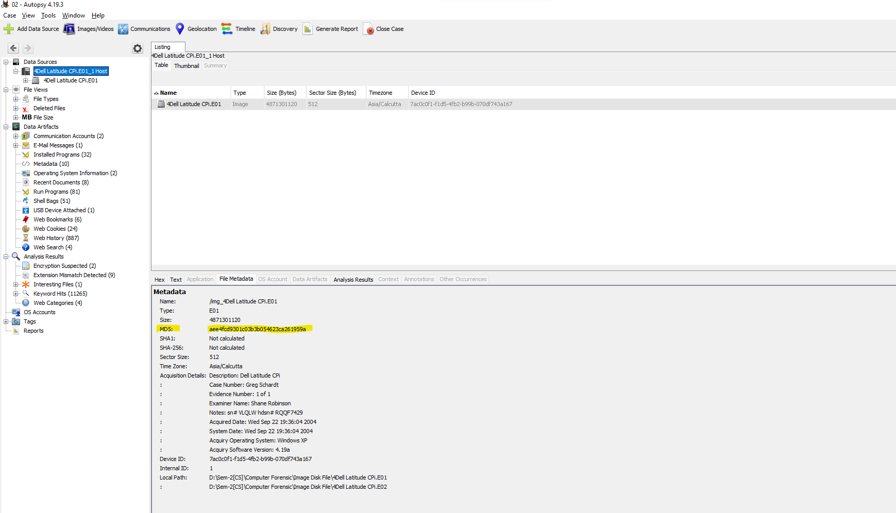
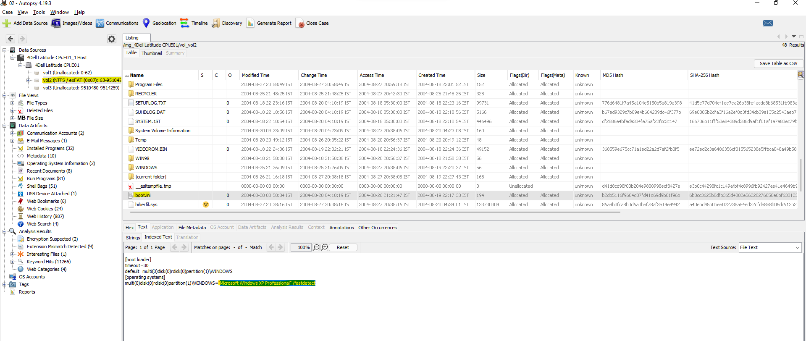

<p align='center' style='font-size:55px' > Computer Forensic </p>

<p align='center'>
<a href="https://github.com/Rajbarot16/"></a>
<a href="#"></a>
<a href="#"></a>
</p>
<br>

<h2>Cfred's Hacking Case Walkthrough </h2>
<p style='font-size:20px'>Case-1: Dell Hacking Case </p>

*  Here we are using CFRED website for analysing Hacking Case which is as below.

* Link:&nbsp;<a href="https://cfreds-archive.nist.gov/Hacking_Case.html">https://cfreds-archive.nist.gov/Hacking_Case.html</a>

<h3>Scenario</h3>

> On 09/20/04 , a Dell CPi notebook computer, serial # VLQLW, was found abandoned along with a wireless PCMCIA card and an external homemade 802.11b antennae. It is suspected that this computer was used for hacking purposes, although cannot be tied to a hacking suspect, G=r=e=g S=c=h=a=r=d=t. (The equal signs are just to prevent web crawlers from indexing this name; there are no equal signs in the image files.)  Schardt also goes by the online nickname of “Mr. Evil” and some of his associates have said that he would park his vehicle within range of Wireless Access Points (like Starbucks and other T-Mobile Hotspots) where he would then intercept internet traffic, attempting to get credit card numbers, usernames & passwords.

> Find any hacking software, evidence of their use, and any data that might have been generated. Attempt to tie the computer to the suspect, G=r=e=g S=c=h=a=r=d=t.v

<br>

**1. What is the image hash? Does the acquisition and verification hash match?**
```
Ans.aee4fcd9301c03b3b054623ca261959a, no acquistion hash found
```
<br>
<p align='center'>

</p>
<br>

**2. What operating system was used on the computer?**
```
Ans. Microsoft Windows XP Professional
```
<br>
<p align='center'>
<a href="#"></a>
</p>
<br>

**3. When was the install date?**
```
Ans. step-1: Go to the path:“C:\Windows\system32\config\Software\Microsoft\Windows NT\CurrentVersion\InstallDate."
     step-2: Thursday, August 19, 2004 10:48:27 PM UTC
```
<br>
<p align='center'>
<a href="#"></a>
</p>
<br>

**4. What is the timezone settings?**
```
Ans. Step-1: Go to the path:“C:\windows\system32\config\system\CurrentControlSet001\Control\TimeZoneInformation”.
     Step-2: Central Standard time.
```
<br>
<p align='center'>
<a href="#"></a>
</p>

**5. Who is the registered owner?**
```
Ans. Step-1: Go to the path:“C:\windows\system32\config\software\Microsoft\Windows NT\CurrentVersion\RegisteredOwner”.
     Step-2: Greg Schardt
```
<br>
<p align='center'>
<a href="#"></a>
</p>
<br>

**6. What is the computer account name?**
```
Ans. Step-1: Go to the path:“C:\windows\system32\config\SAM\Domains\Users\Names”
     Step-2: Mr.Evil
```
<br>
<p align='center'>
<a href="#"></a>
</p>
<br>

**7. What is the primary domain name?**
```
Ans. Step-1: Go to the path:“C:\windows\system32\config\software\Microsoft\Windows NT\CurrentVersion\Winlogon”
     Step-2: N-1A9ODN6ZXK4LQ
```
<br>
<p align='center'>
<a href="#"></a>
</p>
<br>

**8. When was the last recorded computer shutdown date/time?**
```
Ans. Step-1: Go to the path:“C:\windows\system32\config\system\CurrentControlSet001\Control\Windows\ShutdownTime”
     Step-2: C4 FC 00 07 4D 8C C4 01 
```
<br>
<p align='center'>
<a href="#"></a>
</p>

<br>

**9. How many accounts are recorded (total number)?**
<br>
```
Ans. Step-1: Go to the path:“C:\windows\system32\config\SAM\Domains\Users\Names."
```
<br>```Step-2: There are total 5 Accounts recorded Below  ```
<ul>
  <li style=“list-style-type:square”>Administrator</li>
  <li style=“list-style-type:square”>HelpAssitant</li>
  <li style=“list-style-type:square”>Mr. Evil</li>
  <li style=“list-style-type:square”>Guest</li>
  <li style=“list-style-type:square”>HelpAssitant</li>
  <li style=“list-style-type:square”>Support_388945a0</li>
</ul>

<br>
<p align='center'>
<a href="#"></a>
</p>

<br>

**10. What is the account name of the user who mostly uses the computer?**
```
Ans. Mr. Evil logged into the system 15 times.
```
<br>
<p align='center'>
<a href="#"></a>
</p>

<br>

**11. Who was the last user to logon to the computer?**
```
Ans. Mr. Evil
```
<br>
<p align='center'>
<a href="#"></a>
</p>

<br>

**12. A search for the name of “G=r=e=g S=c=h=a=r=d=t” reveals multiple hits. One of these proves that G=r=e=g S=c=h=a=r=d=t is Mr. Evil and is also the administrator of this computer. What file is it? What software program does this file relate to?**
```
Ans. The name of the file is “irunin.ini” & the name of the software program is “Look@LAN”
```
```
The program name Look@LAN is an application that allows users to monitor the clients who are connected to network.
```
```
So in the irunin.ini file, it is mentioned that regowner is Greg Schardt while the LAN user is Mr. Evil which proves that user Mr. Evil & Greg Schardt both are same.
```
<br>
<p align='center'>
<a href="#"></a>
<a href="#"></a>
</p>

<br>

**13.  List the network cards used by this computer**
```
Ans.There are two network cards: 
    1)Compaq WL110 Wireless LAN PC Card  
    2)Xircom CardBus Ethernet 100 + Modem 56
```
```
Go to the path:"C:\windows\system32\config\software\Microsoft\Windows NT\CurrentVersion\NetworkCards" 
```
<br>
<p align='center'>
<a href="#"></a>
<a href="#"></a>
</p>

<br>

**14. This same file reports the IP address and MAC address of the computer. What are they?**
```
Ans. IP Address  : 192.168.1.111
     MAC Address : 00:10:a4:93:3e:09
```
```
Go to the path:"C:\Program Files\Look@LAN\irunin.ini".
```
<br>
<p align='center'>
<a href="#"></a>
</p>

<br>

**15. An internet search for vendor name/model of NIC cards by MAC address can be used to find out which network interface was used. In the above answer, the first 3 hex characters of the MAC address report the vendor of the card. Which NIC card was used during the installation and set-up for LOOK@LAN?**
```
Ans. On looking for the MAC lookup we found out that company name was: XIRCOM
     So, the NIC card used for setup the Look@LAN is: Xircom CardBus Ethernet 100 + Modem 56 (Ethernet Interface)
```
<br>
<p align='center'>
<a href="#"></a>
</p>

<br>

